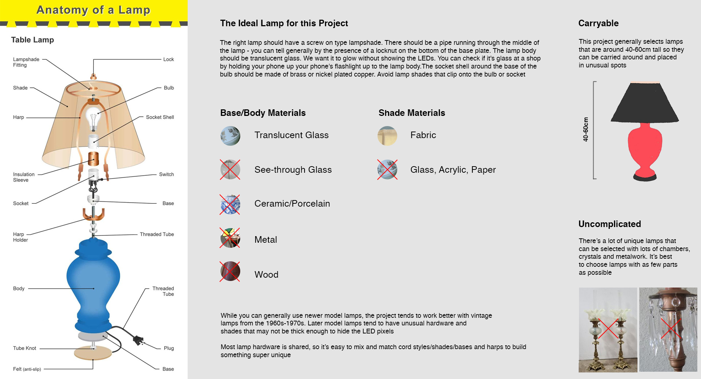
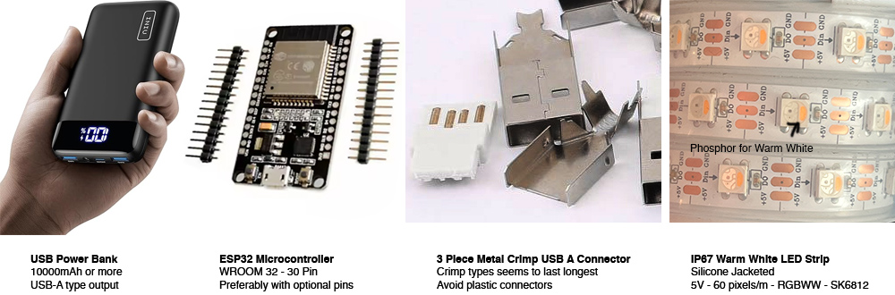

# LampOS

A platform for retrofitting traditional desk lamps with programmable LED controllers to build unique lighted art structures. Using standardized and user friendly hardware based on the ubiquitous ESP32, Neopixels and common sensors, this project seeks to simplify the job of building curious and surreal LED projects for the community to enjoy.

## Lamp Personality & Behaviours

The vision for the lamps is that they remain mostly still and static, as a contrast to the plethora of sound reactive and blinky light art out there. The brightness of the lamps and the colorful glowing base draws attention to the juxtaposition of an ordinary household object in extraordinary places.

Within this vision there is room for the lamps to have personality, shown through subtle behaviour based on things like time, randomness, sensor data, presence/absence of other lamps, etc.

With these sorts of subtle changes, people may begin to realize things are not as static as they seem, creating a somewhat complex puzzle for people to solve and talk about.

## Selecting a lamp to convert

## Lamp Hardware Requirements

This software is intended for the ESP32 platform. Our preferred dev board is an ESP32-WROOM32 30 Pin board variant measuring no wider than 28mm with a chip antenna. Unsoldered/unwelded pins are preferred if possible. This space requirement is so the board can fit comfortably into a standard lamp socket. The boards can be had easily from Amazon and AliExpress for $5-10. The model we use has this pinout <https://lastminuteengineers.com/esp32-pinout-reference/>

The USB connector is a USB type A metal shell crimp on connector. These tend to be the most robust.

By default, a lamp will use about 80 LEDs. The limiting factor at the moment is current draw. generally over 100 LEDs you may have stability issues with a conventional USB source. We recommend purchasing LEDs strips with the following specs:

- Around 2m in length
- SK6812 chipset
- IP67 waterproof
- 5VDC
- RGBWW (warm white) LED Strips
- Spacing of 60 LEDs/m

A 10000mAh battery pack with USB will run this device portably for around 7 hours

You'll also need some basic workshop tools, heat shrink, wire connectors, a soldering iron and a way to print the plastic bulb

There's a handy [build guide with images here](hardware/build/README.md)

## Lamp OS

More details about Lamp OS and other supporting tools can be found in the [software](software/) folder
