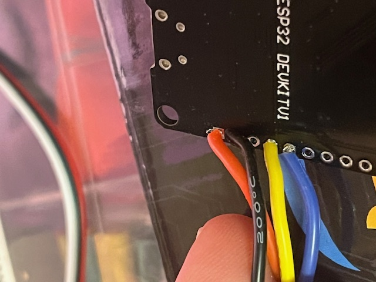
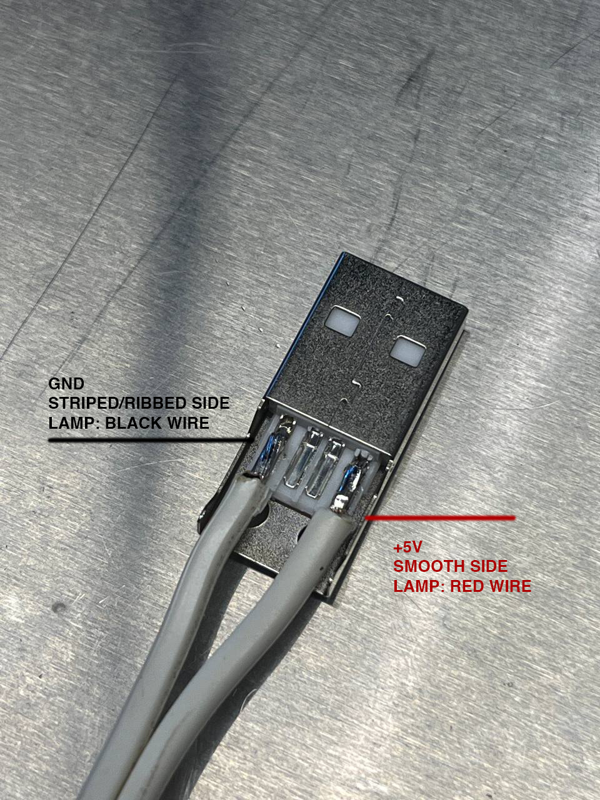

# Lamp Build Guide

As part of the process for making a lamp using Lamp OS, you'll need to convert the lamp to use a DC power source and add LEDs to the shade and base. This guide shows how we usually convert a lamp as an illustrated guide

## Prerequisites

To begin your build, you'll need a number of parts and tools ready to go

### Lamp Parts

More technical details of the parts you'll need to purchase can be found on the main readme

- A working lamp and shade
- USB Type A plug
- Some 4in cable ties
- An ESP32 board programmed with Lamp OS
- about 1.5m of 5V Neopixel style LED strip
- Some 24ga hookup wire in blue, red, black and yellow
- 3D printed bulb (optional)
- a pack of 24ga marettes (optional)
- a pack of lamp hardware (extra nuts/bolts/washers)
- a multimeter

### Tools

- hand drill and some assorted metal drill sizes
- wire cutters and strippers
- soldering iron
- some locking pliers/Visegrips for removing lamp hardware
- screwdrivers for lamp hardware (small phillips and slot head)
- 3d printer (optional)

## Parts of a Lamp

## Disassembly

To begin, you'll have to disassemble your lamp. The easiest way I've found to do this:

 1. remove the lampshade and light bulb
 2. unscrew the locking screw just below the bulb socket if it's there
 3. grab the base of the lamp and the socket and gently rotate them to loosen the entire internal assembly.
 4. The socket should completely unscrew from the rest of lamp hardware with enough turns
 5. clip the lamp cord at the socket side (shown in the figure above). Once the lamp cord is cut, you can pull it out of the lamp. It'll be reused in a later step
 6. take all the rest of the hardware apart and take some photos of the order that the parts go together
 7. put all the glass aside in a safe spot until final assembly

## Things to Build Ahead of Time

### Build a 3d printed shade bulb

Cut 35 LEDs from the strip and solder 3 wires - you may need to pull the LED strip out a little:

- black -> gnd
- yellow -> Din
- red -> +5V

Push the wires through the lower hole and clean up the 3d print so it's square as possible

Wrap the LEDs around the bulb and tuck them into the top hole

Once the LEDs are in place, wrap them in clear tape to fasten them for good

### Build the PCB

Cut 4 wires around 6" each

- black -> GND
- red -> +5v/VIN
- yellow -> D12
- blue -> D14

You can zip tie these wires from any of the board's screw holes next to the D32 or EN pins.

## Assembly

Now the lamp is in pieces, we can begin converting it. The goal of the lamp conversion is to wire it up like this

### Build Steps

Begin by drilling a few holes in the base. These holes should be as close to the lower locknut as possible.

Place a zip tie through the two smaller holes

Install the lamp pipe into the lamp base and install a top and bottom nut and bottom lock washer to secure the pipe in place. You may need to test fit the base glass a few times to ensure the pipe is in the right position

Cut and remove the lamp cord from the socket

Strip the cable and solder it to the USB connector. The ribbed or striped side of the cable should be ground

Double check your work on soldering the connector with a multimeter. Plug the connector into the battery. Connect the black lead to the ribbed/striped side of the lamp cord and the red lead to the other. In DC voltage mode, make sure 2-5V is coming out of the connector and in the right polarity.

On the base LED strip, solder 3 wires:

- black -> gnd
- blue -> Din
- red -> +5V

And wrap it around the lamp pipe to the top of the base glass. It's generally about 30-40 LEDs

Tie off the base LEDs with a couple of wire ties

We can now begin putting the lamp glass and socket back together. Cut another 3 red, black and blue wires to feed down from the bottom of the socket down to the bottom of the base

Put the top of the socket back into place and place the lamp PCB into the socket

Use marettes to connect all the like colored wires together

Once all the connections are made, clip the bulb onto the socket by pushing all the wires into the 3d printed bulb and then pushing down until it clicks into place. If you don't have a 3d printer, you can wrap the LEDs around the harp instead

Now to wire the base. Connect the striped or ridged lamp cord to the black wire. The red to the other lamp cord. Also add the red wire and black wires from the base LEDs and use a marette or solder/heatshrink to connect them all. the blue and blue wire will connect in the same way. Plug in the lamp and make sure it turns on. If it works, then strap them all to the base using the wire tie placed earlier

> Note: this build includes DMX wiring, the large black cable, which is based on an optional prototype

Add the lampshade and plug the lamp in! With any luck, it'll spin up with the built in colors. From here, you can update your lamp by finding `lamp-configurable` in your wifi list and visiting <http://192.168.4.1> from any web browser to configure the lamp's name and colors.

This ends the tutorial for the basic build for the lamps
